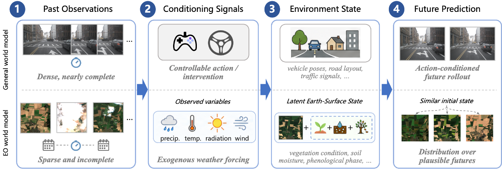
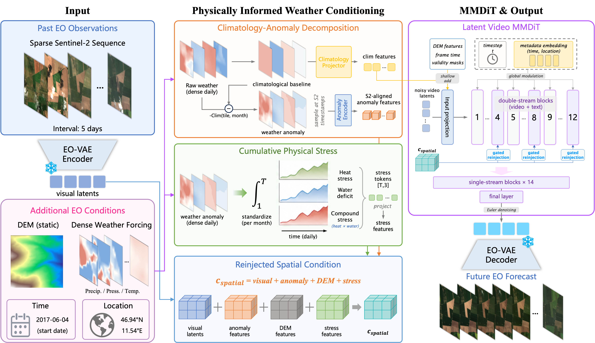

<p align="center">
  <b>EO-WM: A Physically Informed World Model for Probabilistic Earth Observation Forecasting</b>
</p>

<p align="center">
  <a href="https://arxiv.org/pdf/2606.27277">
    
  </a>
</p>

<p align="center">
  <a href="https://arxiv.org/pdf/2606.27277">Preprint</a> ·
  <a href="#benchmarks">Benchmarks</a> ·
  <a href="#quick-start">Quick Start</a> ·
  <a href="#evaluation">Evaluation</a> ·
  <a href="#citation">Citation</a>
</p>


## News

- **2026-06-26**: We release benchmark CSVs and Earthformer reference evaluation scripts.


## Highlights
<p align="center">
  
</p>


- **EO forecasting as world modeling**: future satellite observations are predicted from sparse EO context and weather forcing under partial observability.
- **Physically informed conditioning**: EO-WM decomposes weather into climatology, anomaly, and cumulative stress signals.
- **Weather-response evaluation**: two [EarthNet2021](https://www.earthnet.tech/resources/datasets/earthnet2021)-based benchmarks test vegetation degradation and paired response to changed weather forcing.

## Network Architecture

<p align="center">
  
</p>

EO-WM uses a physically informed latent video diffusion architecture for multispectral EO forecasting. An EO-specific VAE encodes sparse satellite observations into latent video tokens, while weather forcing is decomposed into climatological baseline, weather anomaly, and cumulative stress signals. The diffusion transformer routes these heterogeneous conditions through separate conditioning paths and repeatedly reinjects spatial context into the video-token stream, enabling probabilistic forecasts that remain responsive to future meteorological forcing.


## Benchmarks

<p align="center">
  
</p>

| Benchmark | What it tests |
| --- | --- |
| [Extreme Summer](benchmark_csv/extreme_summer_benchmark.csv) | Severity-aware prediction of vegetation degradation under heat and drought stress. |
| [Seasonal Matched-Pair](benchmark_csv/seasonal_pairs_benchmark.csv) | Whether forecasts change in the correct direction and magnitude when weather forcing changes. |

This release contains benchmark metadata and evaluation examples only. The CSV paths are relative to a local EarthNet2021 root, e.g. `extreme_test_split/context/<tile>/...npz`.

## Quick Start

### 1. Download EarthNet2021

Download the `extreme` and `seasonal` splits from the official EarthNet2021 page:  
https://www.earthnet.tech/resources/datasets/earthnet2021

Using the official toolkit:

```bash
pip install earthnet
python -c "import earthnet as en; en.Downloader.get('/path/to/EarthNet2021', ['extreme', 'seasonal'])"
```

Expected layout:

```text
/path/to/EarthNet2021/
|-- extreme_test_split/
|   |-- context/
|   `-- target/
`-- seasonal_test_split/
    |-- context/
    `-- target/
```

### 2. Prepare Earthformer

The provided scripts use Earthformer as a reference model. Install Earthformer and expose its repo path:

```bash
git clone https://github.com/amazon-science/earth-forecasting-transformer.git
cd earth-forecasting-transformer
pip install -e .
export EARTHFORMER_REPO=/path/to/earth-forecasting-transformer
```

Install script dependencies:

```bash
pip install numpy pandas scipy einops omegaconf tqdm pillow earthnet
```

Install PyTorch separately according to your CUDA version.

## Evaluation

### Extreme Summer

```bash
cd /path/to/EO-WM
export EARTHFORMER_REPO=/path/to/earth-forecasting-transformer

python script/earthformer_eval_extreme_summer_bench.py \
  --cfg /path/to/earthformer/cfg.yaml \
  --ckpt_path /path/to/earthformer/checkpoint.ckpt \
  --earthnet_root /path/to/EarthNet2021 \
  --data_csv benchmark_csv/extreme_summer_benchmark.csv \
  --output_dir outputs/earthformer_extreme \
  --batch_size 4 \
  --device cuda:0
```

Main outputs: `metrics.json`, `per_sample_metrics.csv`, and optional visualizations under `vis/`.

### Seasonal Matched-Pair

```bash
cd /path/to/EO-WM
export EARTHFORMER_REPO=/path/to/earth-forecasting-transformer

python script/earthformer_eval_seasonal_bench.py \
  --cfg /path/to/earthformer/cfg.yaml \
  --ckpt_path /path/to/earthformer/checkpoint.ckpt \
  --earthnet_root /path/to/EarthNet2021 \
  --benchmark_pairs_csv benchmark_csv/seasonal_pairs_benchmark.csv \
  --output_dir outputs/earthformer_seasonal \
  --batch_size 4 \
  --device cuda:0
```

The seasonal script expands the pair CSV into per-window inference samples internally. Main outputs: `metrics.json`, `per_pair_metrics.csv`, and `per_window_metrics.csv`.

## Metrics

- **Standard metrics**: EarthNetScore (ENS), Pixel-MAE (P-MAE), and NDVI-MAE (N-MAE).
- **Extreme Summer**: Trough NDVI-MAE (TN-MAE) and Drop Amplitude Error (DAE), including low/mid/high severity-bin summaries.
- **Seasonal Matched-Pair**: Divergence Reproduction Ratio (DRR), Directional Hit Rate (DHR), and Paired Divergence Correlation (PDC).

The model-forward code is Earthformer-specific, while the metric logic can be adapted to any model that produces aligned EarthNet2021 target-window predictions.


## Citation


```bibtex
@article{luo2026eowm,
  title={EO-WM: A Physically Informed World Model for Probabilistic Earth Observation Forecasting},
  author={Luo, Junwei and Yuan, Shuai and Yang, Zhenya and Li, Yansheng and Liu, Zhe and Zhao, Hengshuang},
  journal={arXiv preprint arxiv:2606.27277},
  year={2026}
}
```


For questions, please contact `luojunwei@whu.edu.cn`.

## Acknowledgements

We thank the creators and maintainers of [EarthNet2021](https://www.earthnet.tech/resources/datasets/earthnet2021), [EO-VAE](https://github.com/nilsleh/eo-vae), and [Open-Sora](https://github.com/hpcaitech/Open-Sora) for making their resources publicly available.
